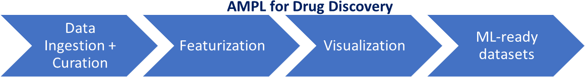
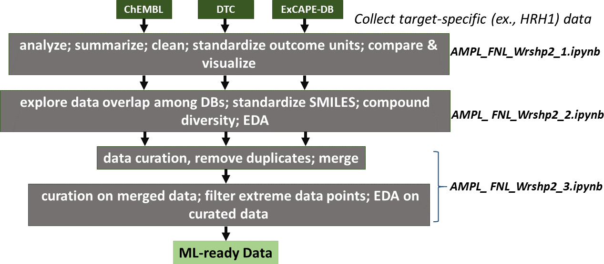

# AMPL-workshop-2

# NCI Data Science Learning Exchange Hands-on Tutorial: 
## *ATOM Modeling Pipeline (AMPL) for Drug Discovery*
*Presented by S. Ravichandran, Ph.D., BIDS, ATOM, Frederick National Laboratory for Cancer Research (FNLCR)*

## Here is the overview of the workshop
 

## Here are the details
 
 

In this workshop, we will demonstrate how to use Atom Modeling PipeLine (AMPL; https://github.com/ATOMconsortium/AMPL), a new, open-source conda-based software that automates key drug discovery steps. AMPL is designed to take molecular binding data (ex., IC50, ki, etc.) and carry out the Machine-Learning (ML) steps with minimal intervention. In this workshop, we will cover the topics listed in the figure shown above. Future workshops will cover the next steps (modeling, inference) in drug discovery.
The workshop on Sep 14 (2021) will be a hands-on tutorial session. We will use Google COLAB for this session. 

Here is the agenda for today: 
  
* We will start with, [AMPL_FNL_Wrshp2_1.ipynb](https://nbviewer.jupyter.org/github/ravichas/AMPL-workshop-2/blob/main/AMPL_FNL_Wrshp2_1.ipynb), and move on to [AMPL_FNL_Wrshp2_2.ipynb](https://nbviewer.jupyter.org/github/ravichas/AMPL-workshop-2/blob/main/AMPL_FNL_Wrshp2_2.ipynb) and end with [AMPL_FNL_Wrshp2_3.ipynb](https://nbviewer.jupyter.org/github/ravichas/AMPL-workshop-2/blob/main/AMPL_FNL_Wrshp2_3.ipynb) notebooks. Please note that when you click on the notebook links, you will see a "Open in COLAB" badge,, click on the image to open the notebook in Google COLAB. To save the notebook in your Google Drive -make sure you are logged in with your Google account-, then you click on "Copy to Drive".  

## Supporting links

### AMPL-workshop-1 link: 
* https://github.com/ravichas/AMPL-workshop-1

### ATOM/AMPL software GitHub link:
* https://github.com/ATOMconsortium/AMPL

### AMPL Software Publication: 
* https://pubmed.ncbi.nlm.nih.gov/32243153/

### AMPL Tutorials:
* https://github.com/ATOMconsortium/AMPL/tree/master/atomsci/ddm/examples/tutorials
* https://github.com/ravichas/AMPL-Tutorial

### How to use AMPL: 
* Download install on your local computers (conda-based Python software)
* Use Google COLAB; check out the following link on how to get-started, https://github.com/ATOMconsortium/AMPL/tree/master/atomsci/ddm/examples/tutorials  
* Use on NIH Biowulf HPC systems, https://hpc.nih.gov/apps/ampl.html (**NIH ID users only**)

### Similar chemoinformatics, drug-discovery software tools:
* DeepChem, https://deepchem.io/
* rdkit, https://www.rdkit.org/

### Chemoinformatics databases:
* ChEMBL: https://www.ebi.ac.uk/chembl/
* PubChem: https://pubchem.ncbi.nlm.nih.gov/
* Drug Target Commons (DTC): https://drugtargetcommons.fimm.fi/
* ExCAPE-DB: https://solr.ideaconsult.net/search/excape/
* DrugBank: https://go.drugbank.com/

### Small molecule drug-discovery related information:
* IC50, kd, ki: https://en.wikipedia.org/wiki/IC50
* SMILES: https://en.wikipedia.org/wiki/Simplified_molecular-input_line-entry_system
* Chemical Similarity: https://en.wikipedia.org/wiki/Chemical_similarity

## Acknowledgements
* ATOM team

